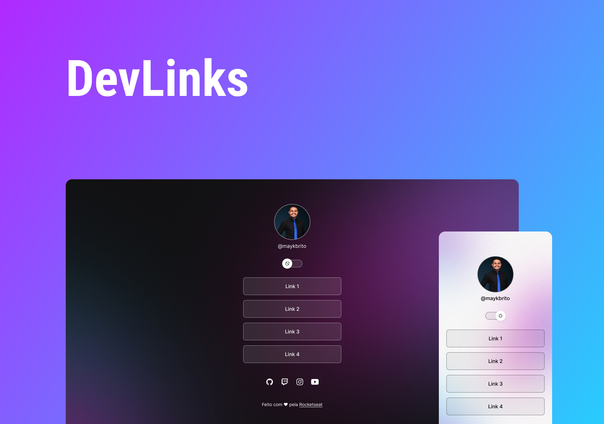

<h1 align="center"> DevLinks </h1>

Esse projeto foi baseado em um curso  promovido pela Rocketseat para ensino de tecnologias WEB.  

  <a href="#-tecnologias">Tecnologias</a>&nbsp;&nbsp;&nbsp;|&nbsp;&nbsp;&nbsp;
  <a href="#-projeto">Projeto</a>&nbsp;&nbsp;&nbsp;|&nbsp;&nbsp;&nbsp;
  <a href="#-layout">Layout</a>&nbsp;&nbsp;&nbsp;|&nbsp;&nbsp;&nbsp;
  <a href="#memo-licença">Licença</a>

 

  

## 🚀 Tecnologias

Esse projeto foi desenvolvido com as seguintes tecnologias:

- HTML e CSS
- JavaScript
- Git e Github
- Figma

## 💻 Projeto

Esse projeto é a base para um agregador de links que pode ser usado como cartão de visitas online.

## 🔖 Layout

Você pode visualizar o layout base do projeto através [DESSE LINK](<https://www.figma.com/file/aWm1jVZMoFOYxO7jXDQ2ZO/DevLinks-(Community)?node-id=10-620&t=sP7PE2VWVnqInCV6-0>). É necessário ter conta no [Figma](https://figma.com) para acessá-lo.

## 📝 Licença

Esse projeto está sob a licença MIT.

---

  

